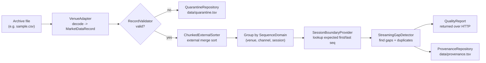
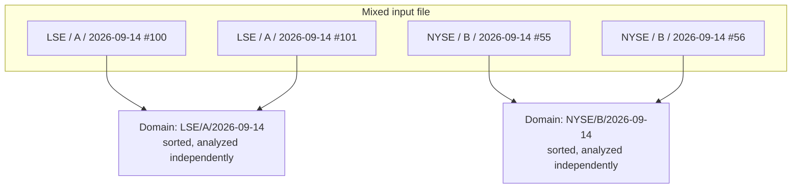

# CLAUDE.md

This file provides guidance to Claude Code (claude.ai/code) when working with code in this repository.

# Market Data Integrity

Spring Boot application that checks historical stock-exchange (venue) market data for **missing** and **duplicate** messages before it is trusted for downstream use (analytics, backtesting, regulatory reporting, etc.).

If you are new to market data: read [What problem does this solve?](#what-problem-does-this-solve) first — the rest of the doc assumes you know why sequence numbers matter.

## What problem does this solve?

Exchanges and trading venues stream out market events (trades, quotes, order updates) as a sequence of numbered messages, e.g. message #100, #101, #102, ... Each message carries a **sequence number** so that a consumer can tell:

- **Did I miss anything?** (a *gap* — e.g. you received #100, #101, then #104: messages #102 and #103 are missing)
- **Did I receive the same thing twice?** (a *duplicate* — e.g. you received #101 twice, likely from a network retransmit or a reconnect replay)

Both problems are common in real feeds (packet loss, reconnects, replayed recovery data) and both are dangerous if unnoticed: a gap means your view of the market is silently incomplete; a duplicate can double-count a trade or quote if not filtered.

This application processes **historical archive files** (not live feeds) and answers, per feed, "is this data complete and clean, and if not, exactly where are the problems?"

## Objectives and how they are achieved

| Objective | How it is achieved |
|---|---|
| Detect every gap and duplicate in a historical archive, exactly and cheaply | `gap/StreamingGapDetector` does a single linear scan of already-sorted data — O(1) extra memory apart from the list of gaps it reports |
| Never mix unrelated sequence spaces | Every record is tagged with a `SequenceDomain` (`venue`, `channel`, `session`) — see [SequenceDomain](#sequencedomain-why-grouping-matters) below. Gap detection only ever runs within one domain |
| Detect gaps at the *start* and *end* of a session, not just internal ones | `boundary/SessionBoundaryProvider` supplies the authoritative first/last expected sequence number per domain (from `config/session-boundaries.csv`), so "we never received the first 5 messages" is detectable even though there is no earlier message to compare against |
| Reject bad data early, without losing it | `quality/RecordValidator` runs cheap checks per record *before* the expensive sort step; anything invalid is written to `quarantine/QuarantineRepository` with a reason, instead of being silently dropped or crashing the job |
| Process archives far larger than available RAM | `sort/ChunkedExternalSorter` — see [How sorting works](#how-sorting-works-without-loading-everything-into-ram) below |
| Support new venues/feed formats without touching the pipeline | New formats are added purely by implementing `venue/VenueAdapter`; nothing else in the pipeline needs to change |
| Leave an audit trail of what happened during a run | `provenance/ProvenanceRepository` appends every processing event (record quarantined, domain started/completed, gap found) to `data/provenance.tsv` |

## How it works: the pipeline



Each stage is a separate, independently testable component (see [Package structure](#package-structure) below) — a record flows through validation, sorting, grouping, and gap detection without any stage knowing about the others' internals.

### SequenceDomain: why grouping matters

A single archive file can contain data from multiple venues, channels, and trading sessions all mixed together. Sequence numbers only make sense *within* one venue+channel+session — venue A's message #100 has nothing to do with venue B's message #100. So every record carries a `SequenceDomain(venue, channel, session)`, and the pipeline sorts and groups by domain **before** gap detection ever runs, guaranteeing gap analysis never compares unrelated sequences.



## Instructions
1. Always ask for approval when making changes providing the diffs
2. Keep code clean with clear separation of concerns
3. Ensure classes are immutable
4. Use SOLID principles to keep code clean
5. Keep clean abstraction layers so it simple so the design is supple, easy to change with affecting other layers
6. Always write unit and integration tests that test behaviour and not methods. Write the in a BDD style
 

## Commands

```bash
mvn test                 # run all tests (JUnit 5 + AssertJ)
mvn test -Dtest=StreamingGapDetectorTest              # run one test class
mvn test -Dtest=StreamingGapDetectorTest#findsGapsAndDuplicates  # run one test method
mvn spring-boot:run       # run the app locally (port 8080)
```

This project builds with `release 25` (see `pom.xml`). If the default JDK on `PATH`/`JAVA_HOME` is older, point Maven at a JDK 25 install for every command, e.g.:

```bash
JAVA_HOME="C:\dev\java\25" PATH="C:\dev\java\25\bin:$PATH" mvn test
```

Trigger a processing run against a local file:

```bash
curl -X POST http://localhost:8080/api/v1/historical/process \
  -H 'Content-Type: application/json' \
  -d '{"path":"/absolute/path/to/data.csv"}'
```

## Architecture

Fixed pipeline, one direction, no cycles:

```
VenueAdapter -> RecordValidator -> quarantine (invalid records) -> RecordSorter (external merge)
             -> group by SequenceDomain -> SessionBoundaryProvider lookup -> GapDetector
             -> ProvenanceRepository (append-only audit) -> QualityReport
```

`HistoricalProcessingService` (`application/`) wires this together. It lazily filters invalid records into quarantine via a custom `Iterator` wrapper *before* they reach the sorter, then feeds the sorted stream through a `PeekingIterator`/`DomainIterator` pair that splits it into contiguous per-`SequenceDomain` sub-iterators for the gap detector — this is the key mechanism to understand before touching that class.

A `SequenceDomain` is `(venue, channel, session)`. Sequence numbers are only meaningful within one domain; unrelated domains must never be compared or merged.

### Package boundaries (each is a one-way extension point)

- `venue/` — `VenueAdapter` implementations decode a source format into `MarketDataRecord`. Add a new feed by implementing this interface as a Spring bean and registering it in `VenueAdapterRegistry`. Adapters know nothing about persistence, validation, or quality logic.
- `quality/` — `RecordValidator` runs cheap per-record checks *before* the expensive sort.
- `sort/` — `ChunkedExternalSorter` is a bounded-memory external merge sort: input is chunked to `market-data.sort.chunk-records` records, each chunk sorted and spilled to a temp binary run (`DataOutputStream.writeUTF`-based codec, explicitly noted as demo-only — replace with a fixed-width/columnar codec for production scale), then k-way merged via a `PriorityQueue` of one-record-per-run cursors. Sort key is `(domain, sequence, sourceFile, sourceOffset)`.
- `gap/` — `StreamingGapDetector` does an O(1)-memory-apart-from-gaps scan over one already-sorted, single-domain iterator. It throws `IllegalArgumentException` if it observes mixed domains or unsorted input — callers (i.e. `HistoricalProcessingService`) are responsible for that guarantee, the detector does not defend against it.
- `boundary/` — `SessionBoundaryProvider` supplies authoritative `(firstExpectedSequence, lastExpectedSequence)` per domain, so start/end gaps are detectable, not just internal ones. Default impl (`ConfiguredSessionBoundaryProvider`) reads `config/session-boundaries.csv`.
- `provenance/` — `ProvenanceRepository` is an append-only audit log of processing events (quarantine, domain start/complete, gaps found). Default impl writes `data/provenance.tsv`.
- `quarantine/` — `QuarantineRepository` persists rejected records with validation reason. Default impl writes `data/quarantine.tsv`.
- `application/` — orchestration only (`HistoricalProcessingService`); no venue/format/storage knowledge.
- `api/` — HTTP boundary only (`ProcessingController`); no pipeline logic.
- `domain/` — immutable records (`MarketDataRecord`, `SequenceDomain`, `Gap`, `SessionBoundary`, `QualityReport`) and provenance fields.

The `boundary/provenance/quarantine` interfaces live outside `venue/` deliberately, so file-backed implementations can later be swapped for JDBC/Kafka/object-storage without touching venue adapters or the orchestration contract.

## Config

`src/main/resources/application.yml` — `market-data.sort.chunk-records`, `market-data.boundaries-file`, `market-data.provenance-file`, `market-data.quarantine-file`. Tune `chunk-records` from heap budget and record size; it bounds each in-memory sort run.

## CSV demo format

`venue,channel,session,sequence,eventTimeNanos,instrument,priceMantissa,quantity` — see `sample.csv` for examples and `CsvVenueAdapter` for the parser.

## Known production gaps

Tracked in [PLAN.md](PLAN.md). Summary:

- No job lifecycle/async API for multi-hour archive jobs — `process` is synchronous over HTTP.
- No Micrometer metrics wired up yet (records/sec, gaps, duplicates, run count, merge duration).
- No venue-specific sequence semantics (resets, wraparound, packet-vs-message sequence) — the current model assumes a single monotonic sequence space per domain.
- `QualityReport` is returned over HTTP rather than persisted — can be large for big archives. Provenance/quarantine are already persisted (flat-file), but not yet in a production-grade store.
- No performance benchmarking done yet for `chunk-records`, I/O buffer sizes, GC, or storage throughput.
