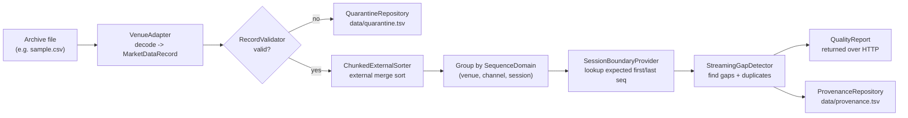
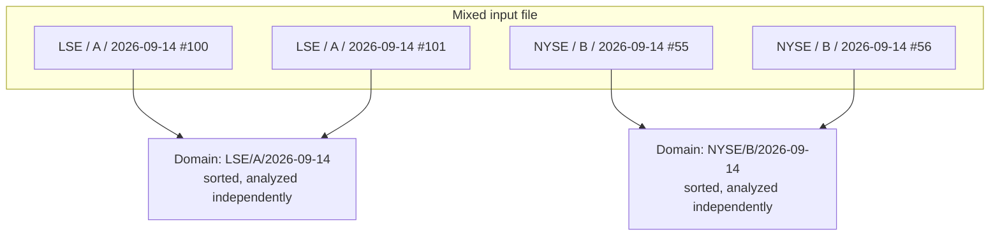

# Market Data Integrity

Spring Boot application that checks historical stock-exchange (venue) market data for **missing** and **duplicate** messages before it is trusted for downstream use (analytics, backtesting, regulatory reporting, etc.).

If you are new to market data: read [What problem does this solve?](#what-problem-does-this-solve) first — the rest of the doc assumes you know why sequence numbers matter.

## What problem does this solve?

Exchanges and trading venues stream out market events (trades, quotes, order updates) as a sequence of numbered messages, e.g. message #100, #101, #102, ... Each message carries a **sequence number** so that a consumer can tell:

- **Did I miss anything?** (a *gap* — e.g. you received #100, #101, then #104: messages #102 and #103 are missing)
- **Did I receive the same thing twice?** (a *duplicate* — e.g. you received #101 twice, likely from a network retransmit or a reconnect replay)

Both problems are common in real feeds (packet loss, reconnects, replayed recovery data) and both are dangerous if unnoticed: a gap means your view of the market is silently incomplete; a duplicate can double-count a trade or quote if not filtered.

This application processes **historical archive files** (not live feeds) and answers, per feed, "is this data complete and clean, and if not, exactly where are the problems?"

## Objectives and how they are achieved

| Objective | How it is achieved |
|---|---|
| Detect every gap and duplicate in a historical archive, exactly and cheaply | `gap/StreamingGapDetector` does a single linear scan of already-sorted data — O(1) extra memory apart from the list of gaps it reports |
| Never mix unrelated sequence spaces | Every record is tagged with a `SequenceDomain` (`venue`, `channel`, `session`) — see [SequenceDomain](#sequencedomain-why-grouping-matters) below. Gap detection only ever runs within one domain |
| Detect gaps at the *start* and *end* of a session, not just internal ones | `boundary/SessionBoundaryProvider` supplies the authoritative first/last expected sequence number per domain (from `config/session-boundaries.csv`), so "we never received the first 5 messages" is detectable even though there is no earlier message to compare against |
| Reject bad data early, without losing it | `quality/RecordValidator` runs cheap checks per record *before* the expensive sort step; anything invalid is written to `quarantine/QuarantineRepository` with a reason, instead of being silently dropped or crashing the job |
| Process archives far larger than available RAM | `sort/ChunkedExternalSorter` — see [How sorting works](#how-sorting-works-without-loading-everything-into-ram) below |
| Support new venues/feed formats without touching the pipeline | New formats are added purely by implementing `venue/VenueAdapter`; nothing else in the pipeline needs to change |
| Leave an audit trail of what happened during a run | `provenance/ProvenanceRepository` appends every processing event (record quarantined, domain started/completed, gap found) to `data/provenance.tsv` |

## How it works: the pipeline



Each stage is a separate, independently testable component (see [Package structure](#package-structure) below) — a record flows through validation, sorting, grouping, and gap detection without any stage knowing about the others' internals.

### SequenceDomain: why grouping matters

A single archive file can contain data from multiple venues, channels, and trading sessions all mixed together. Sequence numbers only make sense *within* one venue+channel+session — venue A's message #100 has nothing to do with venue B's message #100. So every record carries a `SequenceDomain(venue, channel, session)`, and the pipeline sorts and groups by domain **before** gap detection ever runs, guaranteeing gap analysis never compares unrelated sequences.



### Worked example

Using the sample data from [CSV demo format](#csv-demo-format):

```
LSE,A,2026-09-14,100,...
LSE,A,2026-09-14,103,...
LSE,A,2026-09-14,101,...
LSE,A,2026-09-14,102,...
```

All four rows belong to the same domain (`LSE`, `A`, `2026-09-14`). After sorting by sequence number, the run is `100, 101, 102, 103` — no gaps, no duplicates. If row `102` were missing entirely, the detector would report a gap `[102, 102]`. If row `101` appeared twice, it would count one duplicate instead of a gap.

## Package structure

- `venue/` — parsers/adapters that decode a source format into the canonical `MarketDataRecord`. Add a new venue/feed by implementing `VenueAdapter` as a Spring bean; it knows nothing about persistence, validation, or quality logic.
- `quality/` — `RecordValidator` runs cheap per-record checks before the expensive sort.
- `sort/` — bounded-memory external merge sorting (see below).
- `gap/` — `StreamingGapDetector`: O(1)-scan sequence validation for one already-sorted domain. Gap ranges are retained in the report.
- `boundary/` — `SessionBoundaryProvider`: authoritative first/last expected sequence per domain, so start/end gaps are detectable too.
- `provenance/` — `ProvenanceRepository`: append-only audit log of processing events.
- `quarantine/` — `QuarantineRepository`: rejected records with their validation reason.
- `application/` — orchestration only (`HistoricalProcessingService`); wires the stages above together.
- `api/` — HTTP boundary only (`ProcessingController`); no pipeline logic lives here.
- `domain/` — immutable records: `MarketDataRecord`, `SequenceDomain`, `Gap`, `SessionBoundary`, `QualityReport`.

The `boundary/`, `provenance/`, and `quarantine/` interfaces are deliberately kept outside `venue/`: venue adapters only decode data, so the file-backed implementations here can later be swapped for JDBC, Kafka, or object-storage adapters without touching venue adapters or the orchestration contract.

## CSV demo format

Each line:

```
venue,channel,session,sequence,eventTimeNanos,instrument,priceMantissa,quantity
```

Example (`sample.csv`):

```
LSE,A,2026-09-14,100,1000000000,VOD,7250,100
LSE,A,2026-09-14,103,1000000300,VOD,7251,200
LSE,A,2026-09-14,101,1000000100,VOD,7250,150
LSE,A,2026-09-14,102,1000000200,VOD,7251,125
```

## Runtime

- Java 25 (LTS)
- Spring Boot 4.1.1
- Maven

Java 26 is the newest feature release as of September 2026, but Java 25 is the current LTS and is deliberately used for this production-oriented application.

## Run

```bash
mvn test
mvn spring-boot:run
```

Process a local file:

```bash
curl -X POST http://localhost:8080/api/v1/historical/process \
  -H 'Content-Type: application/json' \
  -d '{"path":"/absolute/path/to/data.csv"}'
```

The response is a `ProcessingResult` containing one `QualityReport` per `SequenceDomain` found in the file, including any gaps and the duplicate count.

## How sorting works without loading everything into RAM

Gap detection needs its input sorted by sequence number within each domain, but an archive can be far bigger than available memory. `sort/ChunkedExternalSorter` solves this the same way a database's external sort does:

1. Read records in fixed-size chunks (`market-data.sort.chunk-records`).
2. Sort each chunk in memory, write it to a temporary "run" file on disk.
3. Once all chunks are written, merge all the run files together using a priority queue that only ever holds one record per run in memory at a time.

So memory use is bounded by chunk size, not archive size. For truly massive archives, partition upstream by date/venue/channel/session and run partitions in parallel — this avoids an excessive number of temporary runs and file descriptors.

The demo binary run format uses `DataOutputStream.writeUTF` for clarity. For exchange-scale production, replace it with a fixed-width/length-prefixed binary codec, memory-mapped/off-heap representation, or columnar format — the interfaces intentionally isolate that change.

## Recommended next production steps

See [PLAN.md](PLAN.md) for the tracked, up-to-date list with status. Session-boundary metadata and the quarantine sink are done; persistent provenance/quality output is partially done; job lifecycle/async APIs, Micrometer metrics, venue-specific sequence semantics, and performance benchmarking remain.
